# Async & Multithreading in Python
### A Complete Explainer for the Dune Data API

---

## Table of Contents
1. [Synchronous vs Asynchronous](#1-synchronous-vs-asynchronous)
2. [How Async Works in Python](#2-how-async-works-in-python)
3. [Why It Matters for This API](#3-why-it-matters-for-this-api)
4. [The Blocking Call Problem](#4-the-blocking-call-problem)
5. [Async vs Multithreading](#5-async-vs-multithreading)
6. [How This API Uses Both](#6-how-this-api-uses-both)
7. [Quick Reference](#7-quick-reference)

---

## 1. Synchronous vs Asynchronous

### Synchronous (Normal Python)

In synchronous code, tasks run **one at a time, in order**. If one task is slow — like waiting for an API response — the entire program sits and waits, doing nothing, until that task finishes.

**The Waiter Analogy — Synchronous:**

```
Waiter takes order from Table 1
        ↓
Walks to kitchen... stands there... waits... waits... waits...
        ↓
Kitchen is done. Brings food to Table 1.
        ↓
ONLY NOW goes to Table 2.
        ↓
Table 2 has been waiting the whole time.
```

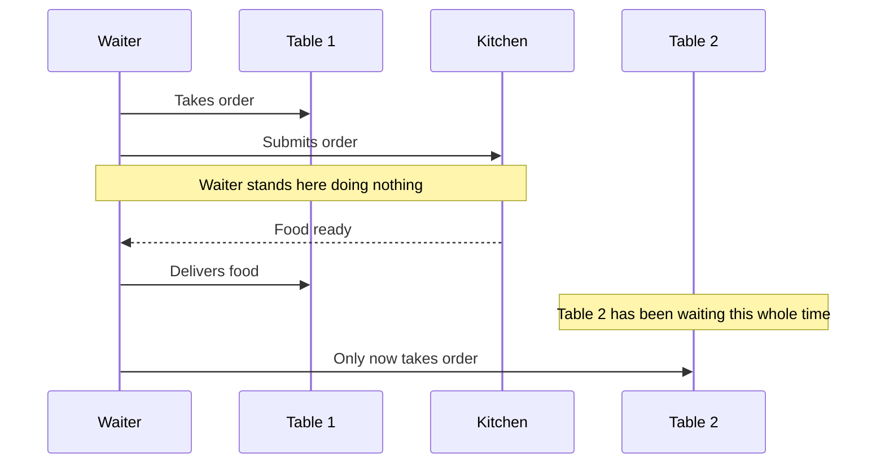

---

### Asynchronous

Async code allows a program to **start a slow task, then go do other things** while waiting for it to finish, then come back to it when it's done.

**The Waiter Analogy — Asynchronous:**

```
Waiter takes order from Table 1, sends it to kitchen
        ↓
While kitchen is working... goes to Table 2
        ↓
Takes Table 2's order, sends it to kitchen
        ↓
Goes to Table 3...
        ↓
Kitchen rings bell for Table 1 → delivers food
        ↓
Kitchen rings bell for Table 2 → delivers food
```

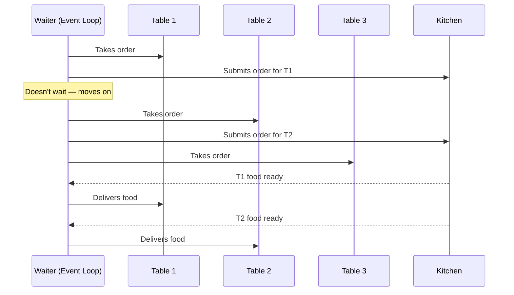

Same one waiter. Far more efficient. **This is async.**

---

## 2. How Async Works in Python

Python's async system is built around an **event loop** — a manager that keeps track of all running tasks and switches between them whenever one is waiting.

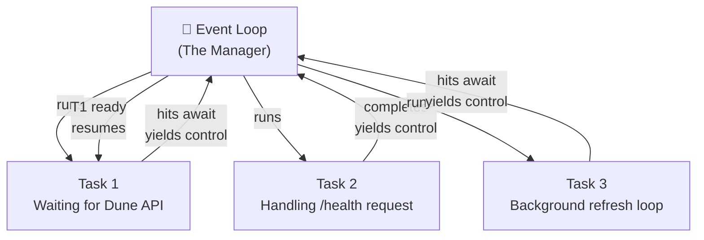

### Two keywords make this work:

**`async def`** — marks a function as asynchronous. It doesn't run immediately when called — it returns a *coroutine* that the event loop can schedule and run.

**`await`** — means *"pause THIS function here and give control back to the event loop until this other task finishes."* The event loop can run other tasks during this pause.

```python
# Without async — BLOCKS the server for 10 seconds
def get_data(name: str):
    rows = fetch_from_dune(query_id)   # server frozen here
    return rows

# With async — server stays free during the wait
async def get_data(name: str):
    rows = await fetch_from_dune(query_id)  # pause here, let others run
    return rows
```

> **Key rule:** You can only `await` inside an `async def` function.
> And you can only `await` something that is itself `async`.

---

## 3. Why It Matters for This API

Dune queries take **5–15 seconds** to respond. Here's the difference:

### Without Async:

```mermaid
gantt
    title Without Async — Requests blocked by each other
    dateFormat  ss
    axisFormat %Ss

    section Server
    User A: /data/stablecoins   :a1, 00, 10s
    User B: /health (waiting)   :a2, after a1, 1s
    User C: /data/traders       :a3, after a2, 10s
```

- User A requests `/data/stablecoins`
- Server calls Dune and **freezes for 10 seconds**
- User B requests `/health` — has to wait 10 seconds for a simple response
- User C has to wait even longer

### With Async:

```mermaid
gantt
    title With Async — Requests handled concurrently
    dateFormat  ss
    axisFormat %Ss

    section Server
    User A: /data/stablecoins   :a1, 00, 10s
    User B: /health             :a2, 00, 1s
    User C: /data/traders       :a3, 01, 10s
```

- User A requests `/data/stablecoins` — server starts Dune fetch, **moves on**
- User B requests `/health` — **handled instantly**
- User C requests `/data/traders` — **starts its own fetch concurrently**
- Dune responds for User A — server sends response
- Dune responds for User C — server sends response

---

## 4. The Blocking Call Problem

`await` only works with other `async` functions. The **Dune SDK is NOT async** — its `get_latest_result()` is a regular blocking function. If we called it directly, it would still freeze the event loop.

```python
# WRONG — even inside async def, this still blocks the event loop
async def fetch_from_dune(query_id: int):
    result = dune.get_latest_result(query_id)  # BLOCKS everything
    return result.result.rows
```

### The Solution: `run_in_executor()`

`run_in_executor()` runs a blocking function in a **separate thread**, so the event loop stays free.

Think of it as hiring a dedicated person just to stand in the kitchen and wait, while the main waiter keeps serving tables.

```python
# CORRECT — blocking call runs in a thread, event loop stays free
async def fetch_from_dune(query_id: int) -> list[dict]:
    loop = asyncio.get_event_loop()

    def _fetch():  # the blocking work
        result = dune.get_latest_result(query_id)
        return result.result.rows

    return await loop.run_in_executor(None, _fetch)
    #                                  ↑
    #                           None = use default thread pool
```

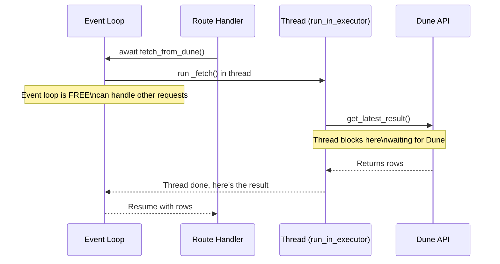

### Rule of Thumb:

| Situation | What to use |
|---|---|
| Waiting on network/API calls, databases | `async def` + `await` |
| Calling a blocking third-party SDK | `run_in_executor()` |
| Pure computation, no waiting | regular `def` |

---

## 5. Async vs Multithreading

Both allow a program to do multiple things "at the same time" — but they work very differently.

### Multithreading

Multithreading means running **multiple threads of execution in parallel**. Each thread is an independent worker.

**Restaurant analogy:** Hiring multiple waiters. Each one independently handles their own tables at the same time.

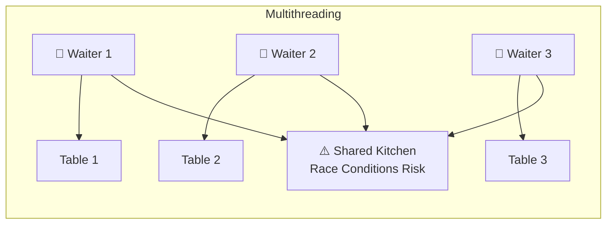

**The problem:** If two threads both try to read/write the same data at the same time, you get a **race condition** — corrupted data, unpredictable bugs.

To prevent this, threads use **locks** — one thread locks a resource, does its work, unlocks it. The other thread waits. Managing locks correctly is hard and is a common source of bugs that are very difficult to reproduce.

**Python's GIL:** Python has a Global Interpreter Lock that prevents more than one thread from executing Python code at the exact same time. This means Python threads don't run in true parallel for CPU work. However, the GIL *is* released during I/O (network calls, file reads), which is why threading still helps for those tasks.

---

### Async

Async is **single-threaded**. There is only ONE worker (the event loop) that switches between tasks whenever one is waiting.

**Restaurant analogy:** One very efficient waiter who never stands idle — the moment they're waiting on the kitchen, they go serve another table.

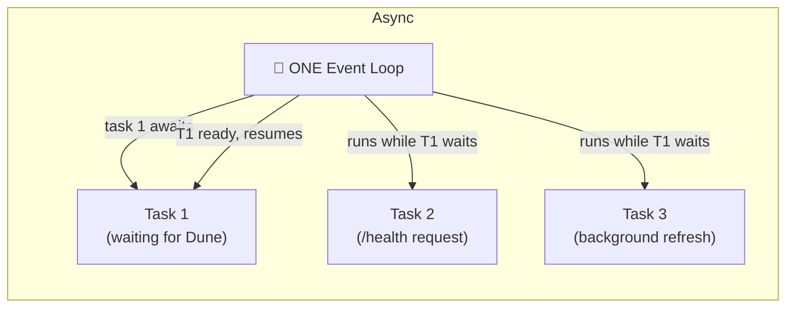

Because it's single-threaded, there are **no race conditions**. Only one piece of code runs at a time — tasks take turns cooperatively. You never need locks.

---

### Side-by-Side Comparison

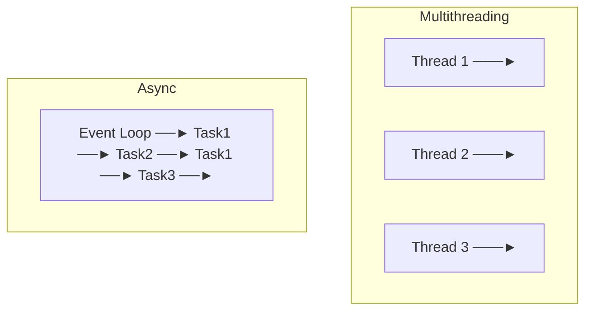

| Feature | Async | Multithreading |
|---|---|---|
| Workers | One (event loop) | Many (threads) |
| Best for | I/O-bound tasks | CPU-bound tasks |
| Race conditions | No | Yes (need locks) |
| Complexity | Lower | Higher |
| True parallelism | No | Yes (mostly) |
| Task switching | Cooperative (at `await`) | Preemptive (OS decides) |
| Python GIL affected | No | Yes |

> **Cooperative** means tasks voluntarily yield control at `await` points.
> **Preemptive** means the OS can interrupt a thread at any time to run another.

### Which One Should You Use?

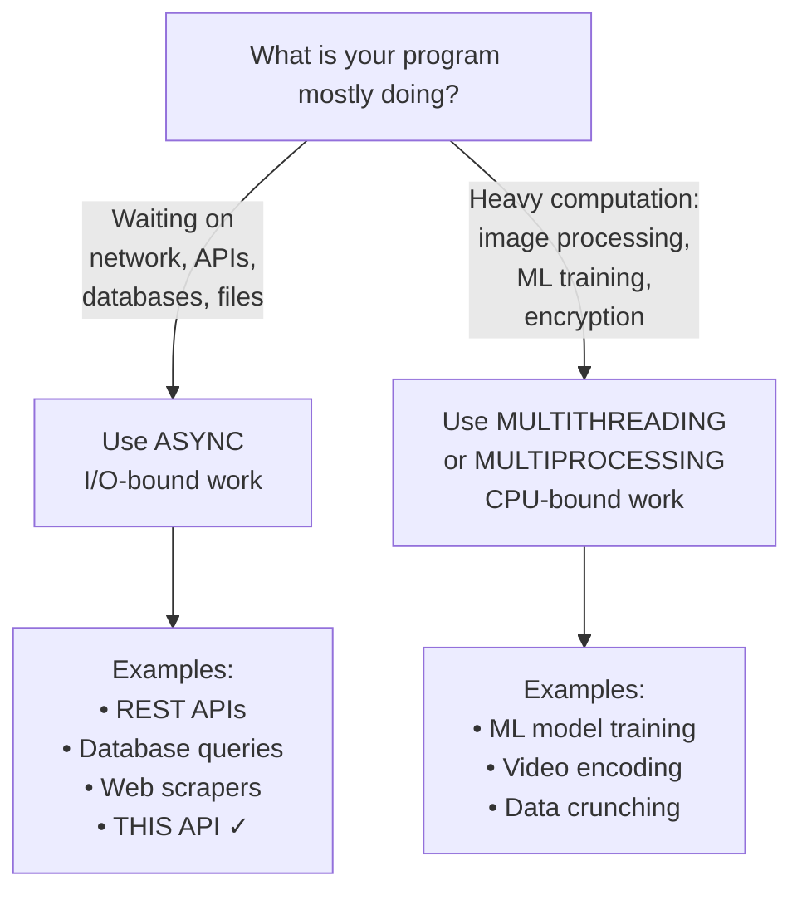

---

## 6. How This API Uses Both

This is the nuanced part: **we actually use both**, each for the right job.

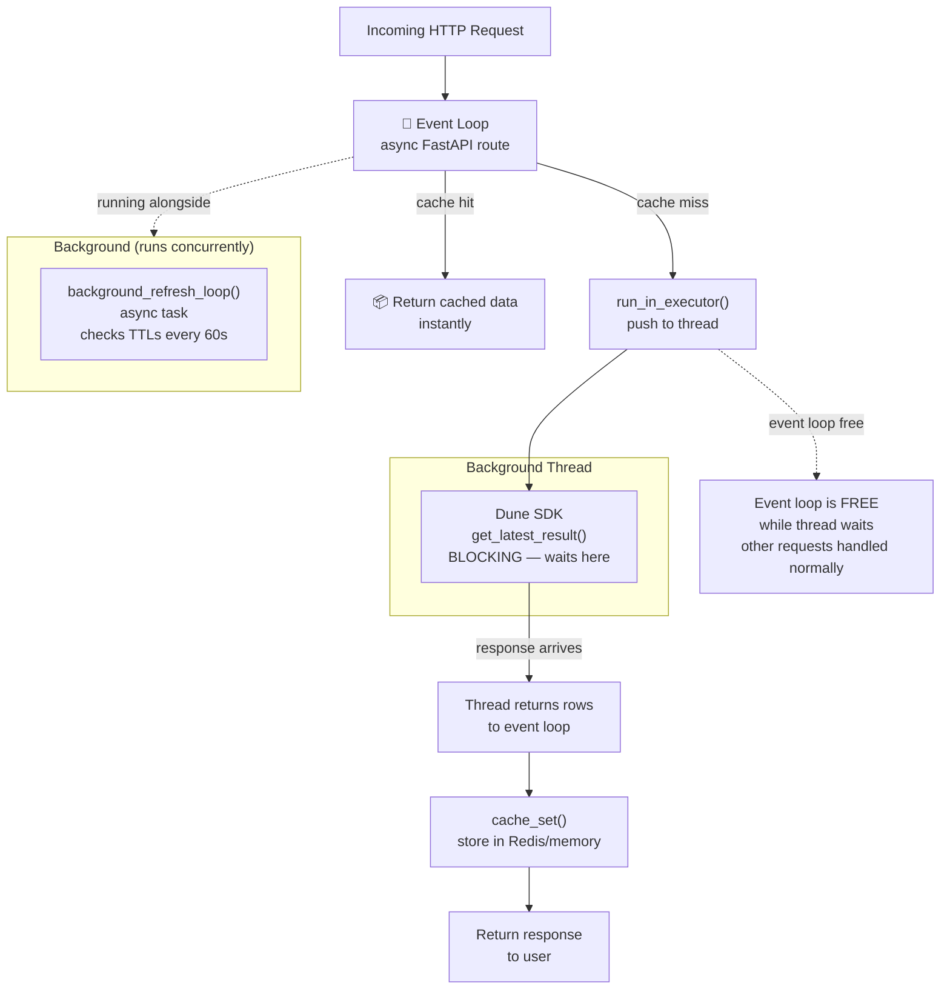

**Async handles all coordination:**
- FastAPI routes are `async def` → multiple requests handled concurrently
- `background_refresh_loop` is async → runs alongside the server without blocking it
- `asyncio.sleep()` yields control back to the event loop while waiting

**`run_in_executor()` uses a thread for the one blocking call:**
- The Dune SDK is not async — `get_latest_result()` is blocking
- We push it into a background thread so the event loop stays free
- When the thread finishes, it hands the result back to the event loop

This is the **recommended pattern** in Python async code: use async for coordination and I/O you control, use threads for blocking third-party code you can't change.

---

## 7. Quick Reference

### Async Keywords

```python
# Mark a function as async
async def my_function():
    ...

# Pause here, let event loop run other tasks
result = await some_async_function()

# Run a BLOCKING function in a thread (doesn't block event loop)
result = await loop.run_in_executor(None, blocking_function)

# Yield control to event loop for N seconds (non-blocking sleep)
await asyncio.sleep(5)

# Run a coroutine as a background task (fire and don't wait)
task = asyncio.create_task(my_async_function())
```

### Decision Flowchart

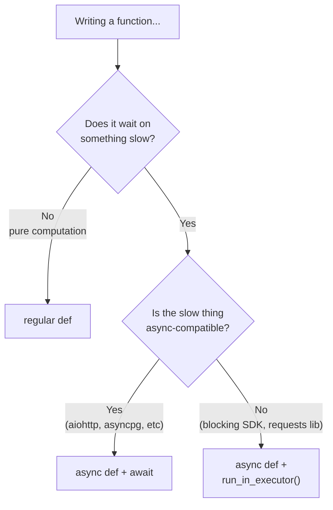

### Common Mistakes

```python
# ❌ WRONG — calling async function without await
async def get_data():
    result = fetch_from_dune(query_id)  # forgot await — returns coroutine, not data

# ✅ CORRECT
async def get_data():
    result = await fetch_from_dune(query_id)

# ❌ WRONG — blocking call inside async without executor
async def fetch_from_dune(query_id):
    result = dune.get_latest_result(query_id)  # blocks the entire event loop

# ✅ CORRECT
async def fetch_from_dune(query_id):
    loop = asyncio.get_event_loop()
    result = await loop.run_in_executor(None, lambda: dune.get_latest_result(query_id))

# ❌ WRONG — using time.sleep() in async code
async def background_loop():
    time.sleep(60)  # blocks the event loop for 60 seconds

# ✅ CORRECT
async def background_loop():
    await asyncio.sleep(60)  # yields control, event loop stays free
```