# Concurrency in the Solana Games ML API
### A Deep Breakdown of Async, Sync, and Multithreading

> **Project:** Solana Game Signals and Predictive Modelling
> **Live App:** [solana-games.app](https://solana-games.app)
> **Python script:** [main.py](https://github.com/joshuatochinwachi/Solana-Game-Signals-and-Predictive-Modelling/blob/main/main.py)
> **GitHub Repo:** [joshuatochinwachi/Solana-Game-Signals-and-Predictive-Modelling](https://github.com/joshuatochinwachi/Solana-Game-Signals-and-Predictive-Modelling)

---

## Table of Contents
1. [The Big Picture — Three Concurrency Modes in One Codebase](#1-the-big-picture)
2. [Every Async Function — Line by Line](#2-every-async-function)
3. [Every Sync Function — Line by Line](#3-every-sync-function)
4. [Where Multithreading Lives](#4-where-multithreading-lives)
5. [How They Work Together](#5-how-they-work-together)
6. [The Paginated Fetch — A Special Case](#6-the-paginated-fetch)
7. [The ML Training Flow — Sync Inside Async](#7-the-ml-training-flow)
8. [What Could Be Improved](#8-what-could-be-improved)

---

## 1. The Big Picture

This API uses **all three concurrency patterns** in a single codebase. Here is the complete map:

```mermaid
flowchart TD
    subgraph ASYNC["🔄 ASYNC — FastAPI Event Loop"]
        R1["All 11 route handlers\nasync def get_gamer_activation()..."]
        R2["fetch_dune_raw()\nasync def"]
        R3["fetch_user_daily_activity_paginated()\nasync def"]
        R4["force_refresh_and_train()\nasync def"]
        R5["lifespan()\nasync context manager"]
    end

    subgraph THREAD["🧵 MULTITHREADING — run_in_executor"]
        T1["fetch_with_auto_pagination()\nBlocking Dune SDK call\nrun in thread pool"]
    end

    subgraph SYNC["⚙️ SYNC — Regular Python"]
        S1["CacheManager.__init__()"]
        S2["cache_data() / get_cached_data()"]
        S3["_rotate_api_key()"]
        S4["FeatureService.create_training_dataset()"]
        S5["FeatureService.create_user_features()"]
        S6["FeatureService.create_prediction_features()"]
        S7["MLModelManager.train_and_evaluate_all()"]
        S8["MLModelManager.predict_champion()"]
        S9["MLModelManager.predict_ensemble()"]
        S10["clean_dataframe_for_json()"]
        S11["_load_metadata() / _save_metadata()"]
    end

    R2 -->|"blocking SDK\npushed to thread"| T1
    T1 -->|"result returned\nto event loop"| R2
    R4 -->|"calls"| R2
    R4 -->|"calls directly\nblocks event loop ⚠️"| S4
    R4 -->|"calls directly\nblocks event loop ⚠️"| S7
    R1 -->|"calls"| R2
```

---

## 2. Every Async Function

### 2.1 — All Route Handlers

Every single API endpoint is `async def`. Here is a representative example:

```python
@app.get("/api/analytics/gamer-activation")
async def get_gamer_activation():
    df = await cache_manager.fetch_dune_raw('gamer_activation')
    df = clean_dataframe_for_json(df)
    metadata = cache_manager.get_metadata_for_key(...)
    return {"metadata": metadata.dict(), "data": df.to_dict('records')}
```

**Why async here?**

The route calls `fetch_dune_raw()` which is async. If the cache is empty, `fetch_dune_raw` goes to Dune and waits 5-15 seconds. Making the route `async def` means FastAPI can handle other incoming requests while this one is waiting for Dune.

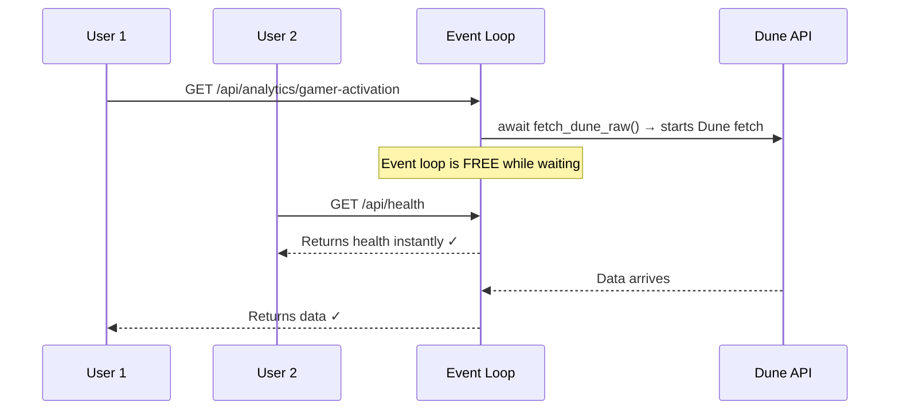

All 11 analytics endpoints follow this exact pattern. They are all async for the same reason.

---

### 2.2 — `fetch_dune_raw()`

```python
async def fetch_dune_raw(self, query_key: str) -> pd.DataFrame:
    # Step 1: Check file cache first (sync — instant)
    cached = self.get_cached_data(query_key)
    if cached is not None:
        return cached  # returns immediately

    # Step 2: Cache miss — define the blocking work
    def fetch_with_auto_pagination():
        df = self.dune_client.get_latest_result_dataframe(...)  # BLOCKING
        return df

    # Step 3: Push blocking work to a thread, await the result
    loop = asyncio.get_event_loop()
    df = await loop.run_in_executor(None, fetch_with_auto_pagination)

    # Step 4: Cache the result (sync — fast)
    self.cache_data(query_key, df)
    return df
```

This function is the **bridge between async and sync** in the entire codebase. It is discussed in detail in [Section 4](#4-where-multithreading-lives).

---

### 2.3 — `fetch_user_daily_activity_paginated()`

```python
async def fetch_user_daily_activity_paginated(self) -> pd.DataFrame:
    all_pages = []
    
    for page_name, query_id in config.user_activity_pages.items():
        # Each page fetch is awaited individually
        df = await self.fetch_dune_raw(cache_key)
        all_pages.append(df)
    
    # Merge all pages
    merged_df = pd.concat(all_pages, ignore_index=True)
    merged_df = merged_df.drop_duplicates(...)
    return merged_df
```

This function is async because it calls `fetch_dune_raw()` 7 times in a loop — once per page. Each `await` pauses and lets the event loop breathe between pages.

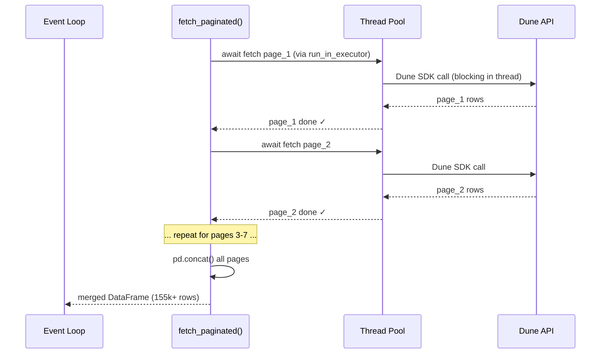

**Important note:** the pages are fetched **sequentially** (one after another), not concurrently. To fetch them in parallel you would use `asyncio.gather()`. This is discussed in [Section 8](#8-what-could-be-improved).

---

### 2.4 — `force_refresh_and_train()`

This is the most complex function in the entire codebase. It does everything:

```python
@app.post("/api/cache/refresh")
async def force_refresh_and_train(request: Request):
    # Step 1: Rotate API key (sync — instant)
    cache_manager._rotate_api_key()

    # Step 2: Fetch all 11 Dune queries (async — slow)
    for query_name in config.dune_queries.keys():
        df = await cache_manager.fetch_dune_raw(query_name)

    # Step 3: Fetch 7 paginated pages (async — very slow)
    daily_activity = await cache_manager.fetch_user_daily_activity_paginated()

    # Step 4: Create training dataset (sync — CPU work, BLOCKS event loop ⚠️)
    training_df = feature_service.create_training_dataset(daily_activity)

    # Step 5: Train ML models (sync — CPU work, BLOCKS event loop ⚠️)
    ml_results = ml_manager.train_and_evaluate_all(training_df)

    # Step 6: Generate predictions (sync — BLOCKS event loop ⚠️)
    prediction_df = feature_service.create_prediction_features(daily_activity)
```

The async parts (Steps 2 and 3) are fine. The sync parts (Steps 4, 5, 6) are where the event loop gets blocked — covered in [Section 8](#8-what-could-be-improved).

---

### 2.5 — `lifespan()`

```python
@asynccontextmanager
async def lifespan(app: FastAPI):
    logger.info("Starting Solana Games ML Analytics API v1.0")
    yield  # server runs here
    logger.info("Shutting down API")
```

This is an async context manager that FastAPI calls at startup and shutdown. The `yield` is the dividing line — everything before runs on startup, everything after runs on shutdown.

Notice this version is **simpler than the Dune API version** — it does not launch a background refresh loop. Refreshes are triggered manually via `POST /api/cache/refresh` (typically by a GitHub Actions cron job).

---

## 3. Every Sync Function

### 3.1 — `CacheManager` — File-Based Cache (All Sync)

```python
def get_cached_data(self, key: str) -> Optional[pd.DataFrame]:
    if self._is_cache_valid(key):
        return joblib.load(filepath)  # reads .joblib file from disk
    return None

def cache_data(self, key: str, data: pd.DataFrame):
    joblib.dump(data, filepath)  # writes .joblib file to disk
    self._save_metadata()        # writes JSON metadata file
```

These are all regular `def` — no async. They do file I/O (reading/writing `.joblib` files), which is technically a slow operation, but since they are called from within `fetch_dune_raw()` before or after the slow Dune call, the impact is small. In a high-traffic production system, you would want to make these async too (using `aiofiles`), but for this use case it is acceptable.

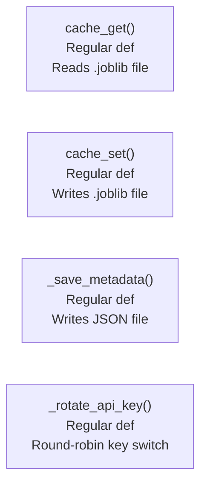

---

### 3.2 — `FeatureService` — Pure CPU Work (All Sync)

```python
def create_user_features(self, user_data: pd.DataFrame, lookback_days: int = 45) -> Optional[Dict]:
    # Pure pandas computation — no I/O, no waiting
    training_period = user_data[user_data['activity_date'] <= cutoff_date]
    features['active_days_last_7'] = last_7_days['activity_date'].nunique()
    features['total_transactions'] = training_period['daily_transactions'].sum()
    # ... more pandas operations
    return features

def create_training_dataset(self, daily_activity_df: pd.DataFrame) -> pd.DataFrame:
    # Loops through every user-game combination
    for (user, project), group in daily_activity_df.groupby(['user_wallet', 'project']):
        features = self.create_user_features(group)
        training_data.append(features)
    return pd.DataFrame(training_data)
```

These are sync because they do **CPU-bound work** — pure pandas operations, math, groupby loops. There is nothing to await. No network call, no file wait. The processor is actively working the entire time.

The problem is that with 155,000+ rows this can take **30-90 seconds** and blocks the event loop completely during that time. See [Section 8](#8-what-could-be-improved).

---

### 3.3 — `MLModelManager` — Scikit-learn Training (All Sync)

```python
def train_and_evaluate_all(self, training_df: pd.DataFrame) -> List[Dict]:
    # Trains up to 5 models: LogReg, RandomForest, GradientBoosting, XGBoost, LightGBM
    for name, config in self.model_configs.items():
        model.fit(X_train_scaled, y_train_balanced)  # CPU-intensive
        y_pred_proba = model.predict_proba(X_test_scaled)
        metrics = {
            'roc_auc': roc_auc_score(y_test, y_pred_proba),
            'accuracy': accuracy_score(y_test, y_pred),
            ...
        }

def predict_champion(self, prediction_df: pd.DataFrame) -> np.ndarray:
    X_scaled = self.scaler.transform(X)
    churn_proba = self.champion['model'].predict_proba(X_scaled)[:, 1]
    return churn_proba
```

Scikit-learn, XGBoost, and LightGBM are all synchronous libraries. They do not support async. Training 5 models sequentially can take minutes.

---

### 3.4 — `clean_dataframe_for_json()`

```python
def clean_dataframe_for_json(df: pd.DataFrame) -> pd.DataFrame:
    df = df.replace([np.inf, -np.inf], None)   # replace infinities
    df = df.where(pd.notna(df), None)           # replace NaN with None
    for col in df.columns:
        if pd.api.types.is_datetime64_any_dtype(df[col]):
            df[col] = df[col].astype(str)       # convert dates to strings
    return df
```

Pure CPU/memory work. No I/O. Regular `def` is correct here.

---

## 4. Where Multithreading Lives

There is **one place** in the entire codebase where multithreading is used: inside `fetch_dune_raw()`.

```python
async def fetch_dune_raw(self, query_key: str) -> pd.DataFrame:
    
    def fetch_with_auto_pagination():
        # This is the blocking work — runs INSIDE a thread
        df = self.dune_client.get_latest_result_dataframe(
            query=QueryBase(query_id=query_id)
        )
        return df
    
    loop = asyncio.get_event_loop()
    df = await loop.run_in_executor(None, fetch_with_auto_pagination)
    #                                ↑
    #               None = use Python's default ThreadPoolExecutor
```

### Why is this necessary?

The Dune SDK (`dune_client`) is a **synchronous library**. Its `get_latest_result_dataframe()` makes an HTTP request and blocks until Dune responds. You cannot `await` it because it was not written as async.

If you called it directly inside `fetch_dune_raw()`:

```python
# WRONG — even inside async def, this blocks the entire event loop
async def fetch_dune_raw(self, query_key):
    df = self.dune_client.get_latest_result_dataframe(...)  # FREEZES everything
```

The event loop would freeze for 5-15 seconds. No other request could be handled.

`run_in_executor()` solves this by running the blocking function in a **separate thread**. The event loop dispatches the work and immediately goes back to handling other tasks. When the thread finishes, it notifies the event loop which then resumes the awaiting coroutine.

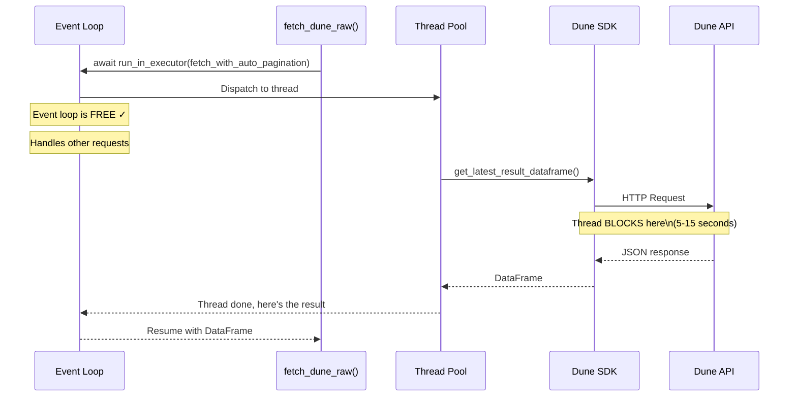

### How `run_in_executor` Works Internally

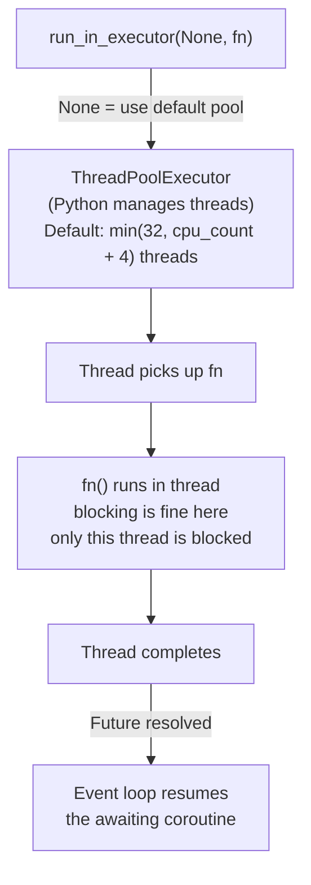

---

## 5. How They Work Together

This is the full request lifecycle for a cache miss on `/api/analytics/gamer-activation`:

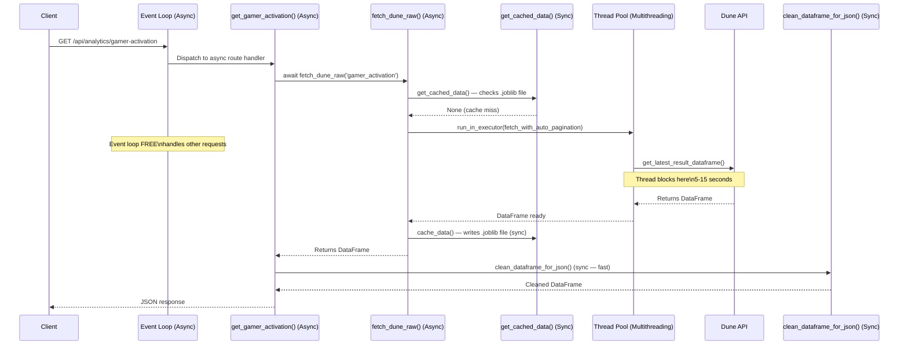

And here is what happens for a **cache hit** (much simpler):

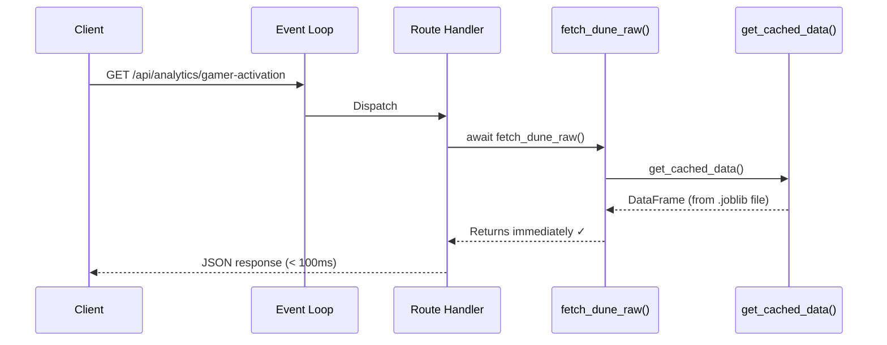

---

## 6. The Paginated Fetch — A Special Case

The `user_daily_activity` dataset is too large for a single Dune query (~155,000+ rows). You split it across 7 queries and merge them:

```python
async def fetch_user_daily_activity_paginated(self) -> pd.DataFrame:
    all_pages = []
    
    for page_name, query_id in config.user_activity_pages.items():
        cache_key = f'user_activity_{page_name}'
        
        # Temporarily register this page in dune_queries
        config.dune_queries[cache_key] = query_id
        
        # Fetch page (async — goes through full fetch_dune_raw pipeline)
        df = await self.fetch_dune_raw(cache_key)
        
        # Restore original queries dict
        config.dune_queries = original_queries
        
        all_pages.append(df)
    
    merged_df = pd.concat(all_pages, ignore_index=True)
    merged_df = merged_df.drop_duplicates(subset=['day', 'user_wallet', 'project'])
    return merged_df
```

### Sequential vs Concurrent — What's Happening Here

The pages are fetched **one at a time** (sequential), not simultaneously:

```mermaid
gantt
    title Sequential Page Fetching (Current)
    dateFormat ss
    axisFormat %Ss

    section Pages
    page_1 (Dune fetch)     :p1, 00, 10s
    page_2 (Dune fetch)     :p2, after p1, 10s
    page_3 (Dune fetch)     :p3, after p2, 10s
    page_4 (Dune fetch)     :p4, after p3, 10s
    page_5 (Dune fetch)     :p5, after p4, 10s
    page_6 (Dune fetch)     :p6, after p5, 10s
    page_7 (Dune fetch)     :p7, after p6, 10s
```

**Total time: ~70 seconds** (assuming 10s per page)

With `asyncio.gather()`, all 7 pages could be fetched in parallel:

```mermaid
gantt
    title Concurrent Page Fetching (asyncio.gather — potential improvement)
    dateFormat ss
    axisFormat %Ss

    section Pages
    page_1 :p1, 00, 10s
    page_2 :p2, 00, 10s
    page_3 :p3, 00, 10s
    page_4 :p4, 00, 10s
    page_5 :p5, 00, 10s
    page_6 :p6, 00, 10s
    page_7 :p7, 00, 10s
```

**Total time: ~10 seconds** (all run simultaneously)

However there is a catch — the temporary `config.dune_queries` mutation inside the loop is **not thread-safe**. You would need to refactor before making this concurrent. This is covered in [Section 8](#8-what-could-be-improved).

---

## 7. The ML Training Flow — Sync Inside Async

The `force_refresh_and_train()` endpoint is the most important endpoint in the whole API — it is the one called by GitHub Actions. Here is what the concurrency timeline looks like:

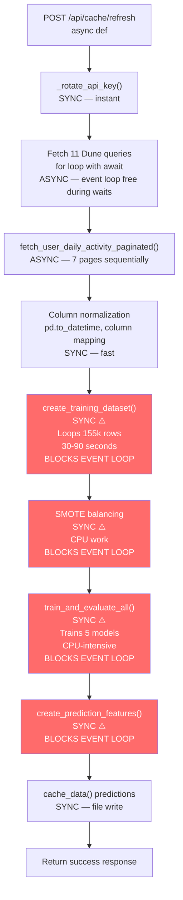

The red boxes are sync CPU-bound operations running inside an async function. During these phases, the **event loop is completely blocked**. Any incoming request during model training will queue up and wait.

In practice this is acceptable for this use case because:
- Refresh is triggered by GitHub Actions (not users)
- It happens infrequently (weekly/daily)
- The blocking happens in a background process, not in response to user requests

But it is important to know it is happening.

---

## 8. What Could Be Improved

### Problem 1: CPU-Bound Work Blocking the Event Loop

```python
# CURRENT — blocks the event loop during training
training_df = feature_service.create_training_dataset(daily_activity)  # 30-90s
ml_results = ml_manager.train_and_evaluate_all(training_df)             # minutes
```

**Fix:** Wrap in `run_in_executor()` just like the Dune SDK calls:

```python
# IMPROVED — event loop stays free during training
loop = asyncio.get_event_loop()
training_df = await loop.run_in_executor(
    None,
    feature_service.create_training_dataset,
    daily_activity
)
ml_results = await loop.run_in_executor(
    None,
    ml_manager.train_and_evaluate_all,
    training_df
)
```

---

### Problem 2: Sequential Page Fetching

```python
# CURRENT — 7 pages fetched one after another (~70 seconds)
for page_name, query_id in config.user_activity_pages.items():
    df = await self.fetch_dune_raw(cache_key)
    all_pages.append(df)
```

**Fix:** Use `asyncio.gather()` to fetch all 7 pages concurrently (~10 seconds):

```python
# IMPROVED — all 7 pages fetched concurrently
tasks = [
    self.fetch_dune_raw(f'user_activity_{page_name}')
    for page_name in config.user_activity_pages.keys()
]
all_pages = await asyncio.gather(*tasks)
```

Note: this requires removing the `config.dune_queries` mutation inside the loop first.

---

### Problem 3: File-Based Cache vs Redis

The current cache writes `.joblib` files to disk. This is fine for a single server but has limitations:

| | Current (.joblib files) | Redis |
|---|---|---|
| Survives restart | ✓ (files persist) | ✓ |
| Multiple instances | ✗ each server has own files | ✓ shared |
| async-compatible | ✗ blocking file I/O | ✓ aioredis |
| Speed | Slower (disk) | Faster (memory) |
| Setup complexity | Zero | Low |

---

## Summary Table

| Function | Type | Why |
|---|---|---|
| All 11 route handlers | **Async** | Calls `fetch_dune_raw()` which is async |
| `fetch_dune_raw()` | **Async** | Bridges async event loop to blocking Dune SDK |
| `fetch_with_auto_pagination()` (inner function) | **Multithreaded** | Runs in thread via `run_in_executor` — blocking SDK call |
| `fetch_user_daily_activity_paginated()` | **Async** | Calls `fetch_dune_raw()` 7 times |
| `force_refresh_and_train()` | **Async** (partially) | Async for Dune fetches, sync for ML training |
| `lifespan()` | **Async** | FastAPI startup/shutdown hook |
| `get_cached_data()` / `cache_data()` | **Sync** | File I/O — acceptable since it's fast |
| `_rotate_api_key()` | **Sync** | Simple dict/file operation, instant |
| `_load_metadata()` / `_save_metadata()` | **Sync** | JSON file read/write — fast |
| `create_user_features()` | **Sync** | Pure CPU/pandas work — no I/O |
| `create_training_dataset()` | **Sync** ⚠️ | CPU-bound, blocks event loop during refresh |
| `create_prediction_features()` | **Sync** ⚠️ | CPU-bound, blocks event loop during refresh |
| `train_and_evaluate_all()` | **Sync** ⚠️ | ML training — CPU-intensive, blocks event loop |
| `predict_champion()` | **Sync** | Fast inference — acceptable |
| `predict_ensemble()` | **Sync** | Fast inference — acceptable |
| `clean_dataframe_for_json()` | **Sync** | Fast pandas operation — correct |

> ⚠️ = Sync function called inside an async context without `run_in_executor`, which blocks the event loop


